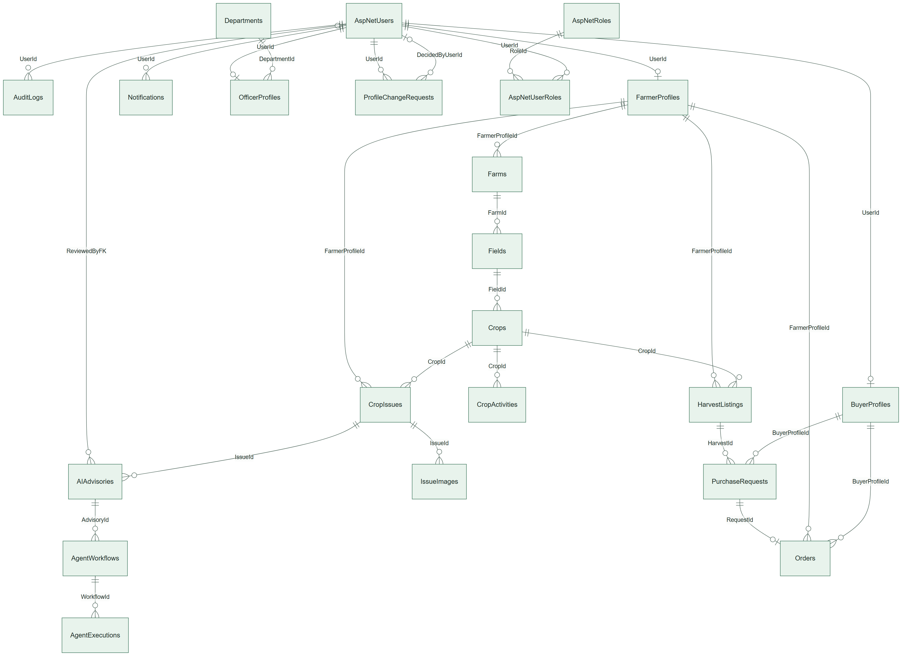
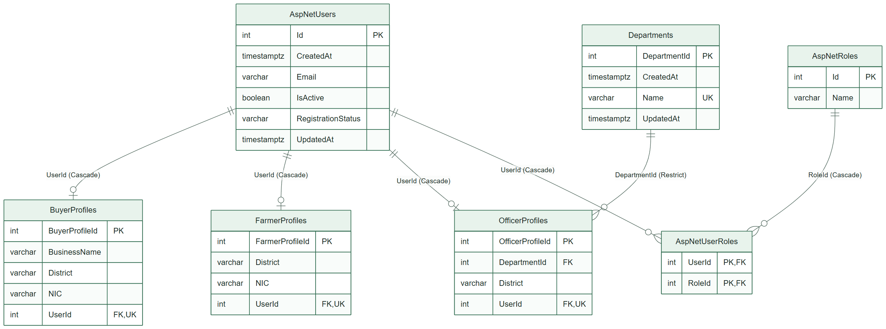
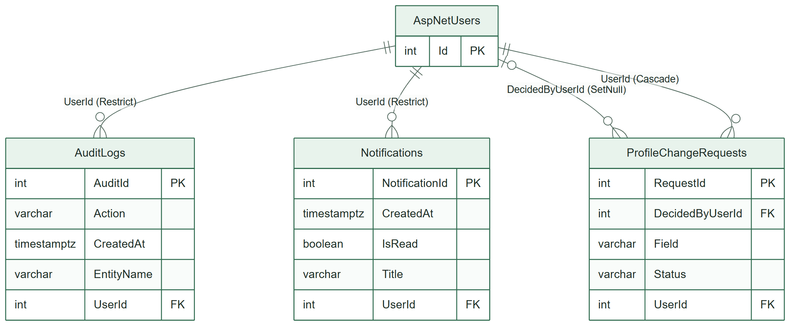
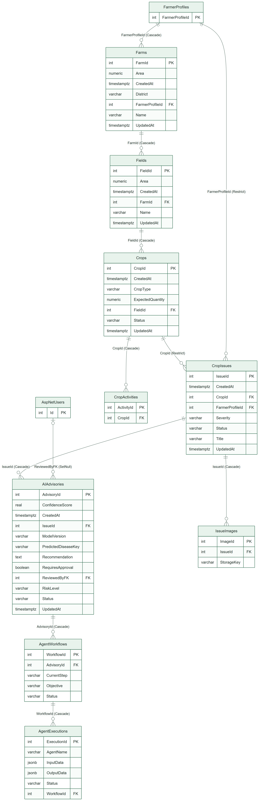
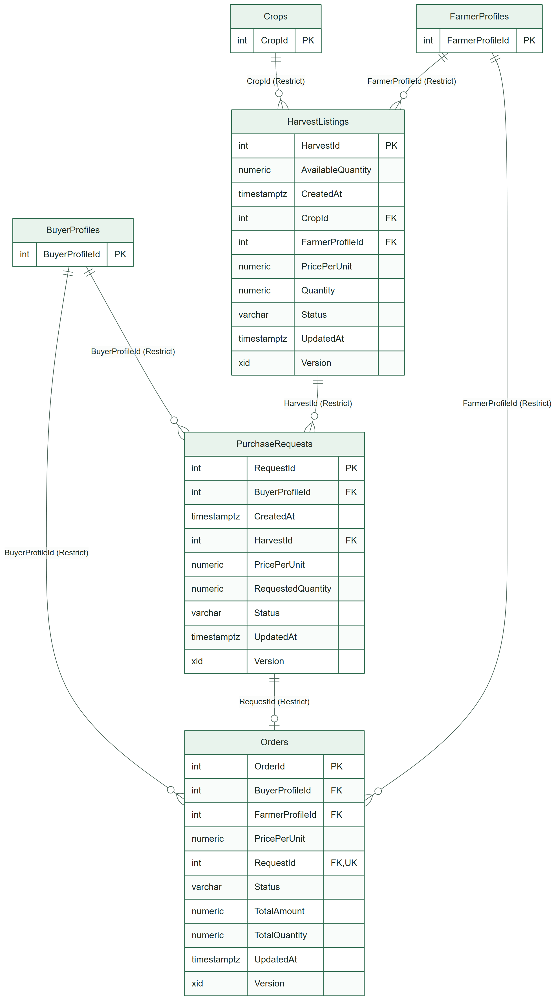
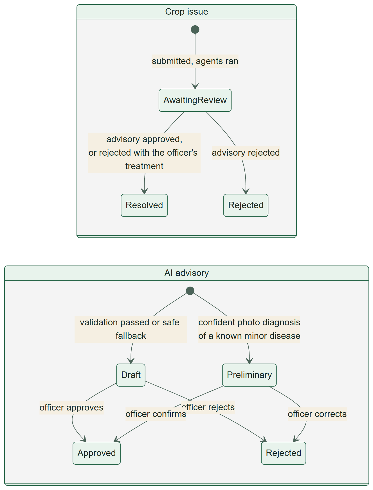
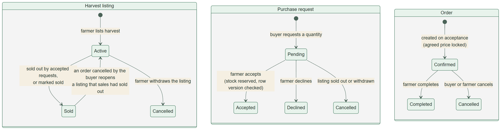

# Database design

> Part of the AgriLink Sri Lanka project documentation ([index](../README.md)). Section numbers follow the team's SE3090 Assignment 1 report, so "§" references point to its sections.

# 4. Database design

## 4.1 Approach

The database is **PostgreSQL**, accessed through **EF Core 8 with the Npgsql provider**, code first. The C# entities in `Models/` and the fluent configuration in `AgriLinkDbContext.OnModelCreating` define the schema. It evolved through **14 migrations**, all applied to production (§10.6). The API applies pending migrations at start-up, and an integration test fails if the model has a change without a migration.

**Migrations in order**

| Migration | What it added |
|---|---|
| `20260816_InitialCreate` | Identity tables, profiles, farms, fields, crops, activities, notifications, audit log |
| `20260830_AddIssueAdvisoryAndMarketplaceTables` | Crop issues, AI advisories, agent workflows and executions, harvest listings, purchase requests, orders |
| `20260911_AddDepartments` | Departments and the officer's department |
| `20260912_AddAdvisoryReviewNote` | The officer's review note |
| `20260917_AddIssueImages` | Issue photos |
| `20260917_AddPhotoDiagnosisToAdvisories` | Predicted disease, model confidence and version, escalation reasons |
| `20260917_AddOfficerDiagnosisToAdvisories` | Confirmed disease and officer treatment |
| `20260917_AddRegistrationApproval` | Registration status and rejection reason |
| `20260922_CancelStalePendingPurchaseRequests` | Data fix: cancel pending requests on listings that were no longer active |
| `20260922_AddUserProfileFields` | Username, display name, profile photo |
| `20260922_AddProfileChangeRequests` | Change requests with a filtered unique index (one pending request per field) |
| `20260927_LockAgreedPriceAndGuardConcurrentEdits` | Agreed price on requests and orders; `xmin` row versions |
| `20260928_WidenOrderTotalAmount` | `numeric(18,2)` totals |
| `20260928_AddAuditTimestamps` | `CreatedAt`/`UpdatedAt` on every business table, with existing rows backfilled |

## 4.2 Entity-relationship model

The schema has **22 application tables** plus the ASP.NET Identity tables it uses: 26 tables in production, 32 foreign keys and 70 indexes. The first figure below shows every relationship, and the next four show the columns of each area. The full data dictionary is in Appendix B.

*ER overview: every table and relationship (crow's-foot notation; labels are the foreign-key columns)*

*Accounts: users, roles, the three role profiles and departments*

*Administration: notifications, audit log and profile-change requests*

*Farms, crops and the AI advisory: agent workflow state is stored in AgentWorkflows and AgentExecutions*

*Marketplace: listings, purchase requests and orders, linked to the farmer and buyer profiles and the crop*

## 4.3 Keys, constraints and indexes

- **Primary keys** are `integer` identity columns. Identity's `AspNetUserRoles` uses a composite key.
- **Foreign keys and delete behaviour** follow ownership:
  - `Cascade` where a child cannot exist without its parent (farm → fields → crops → activities; issue → images; advisory → workflow → executions; user → profile).
  - `Restrict` where deleting would destroy business history. A crop with issues or listings cannot be deleted, and neither can listings with requests, requests with orders, or a department that still has officers. The API turns these cases into a clear 409 or 400 message.
  - `SetNull` for "who decided" links (`AIAdvisories.ReviewedByFK`, `ProfileChangeRequests.DecidedByUserId`).
- **Unique indexes:** normalised email and username, one profile per user (`FarmerProfiles.UserId`, `BuyerProfiles.UserId`, `OfficerProfiles.UserId`), one order per purchase request (`Orders.RequestId`), department names. A **filtered unique index** `(UserId, Field) WHERE Status = 'Pending'` allows only one pending change request per field.
- **Secondary indexes** exist on every foreign key and on the columns lists filter by: `Status` on issues, advisories, listings, requests and orders, and `District` on farms.
- **Types:** `numeric(8,2)` for areas, `numeric(10,2)` for quantities and prices, `numeric(18,2)` for order totals, `date` for agricultural dates, `timestamptz` for events, `varchar(n)` with lengths matching the DTO validation, and `jsonb` for agent inputs and outputs. Enums are stored as readable strings (`varchar(20)`).
- **Concurrency:** `HarvestListings`, `PurchaseRequests` and `Orders` map PostgreSQL's system column `xmin` as a row version. Two buyers accepting the last stock, or a complete racing a cancel, cannot both succeed; the loser gets 409.

## 4.4 Normalisation

The schema is in third normal form, with two deliberate exceptions:

- **The agreed price is copied** onto `PurchaseRequests.PricePerUnit` and `Orders.PricePerUnit`/`TotalAmount`. A farmer can change a listing's price later without rewriting orders already agreed. This is a historical fact, not a duplicate.
- **`District` is stored on both `Farms` and the farmer's profile.** The profile district decides which officer approves the farmer. A farm's district decides which officer reviews issues on it and which weather is fetched, and a farmer may farm in another district.

Role-specific data is split into `FarmerProfiles`, `BuyerProfiles` and `OfficerProfiles`, each one-to-one with `AspNetUsers`, instead of many nullable columns on the user table.

## 4.5 Transactions and audit fields

- **Transactions.** Work that spans several saves runs in an explicit transaction (`DatabaseTransactions.BeginIfSupportedAsync`). Examples are registration, where Identity's `UserManager` saves the user and the role separately before the profile is added, and admin user creation. Everything else is a single `SaveChangesAsync`, which EF Core wraps in a transaction. A PostgreSQL integration test proves that a failed step rolls back (§7.4).
- **Audit fields.** Every business table has `CreatedAt`. The ten tables whose rows change have `UpdatedAt`, set automatically by the DbContext (`IHasUpdatedAt`, stamped in `SaveChanges`) whenever a save changes the row.
- **Audit log.** `AuditLogs` records who did what to which entity, with the old and new values: approvals, rejections, role and status changes, password resets and profile changes. Admins can read it, paged and filtered by entity.

## 4.6 Status workflows

*Crop issue and AI advisory states. Only an officer's decision moves an advisory out of Draft or Preliminary.*

*Harvest listing, purchase request and order states*

## 4.7 Agent workflow state

`AgentWorkflows` holds one row per run: the objective, status (`Running`, `Completed`, `Failed`), current step, start and end times, and `RequiresHumanApproval`. `AgentExecutions` holds one row per step: agent name, `jsonb` input, `jsonb` output (including a structured error when a step fails), status and timings. The advisory holds the outcome: risk level, recommendation, confidence, photo diagnosis, escalation reasons, status, reviewer, review time, note and the officer's treatment. ADR-005 explains this design.

What is **not** stored: hidden model reasoning (thinking is switched off), prompts containing personal data, API keys, and raw third-party responses. The Planner stores only its plan, its short stated reasons and the metadata listed in §3.4.

## 4.8 Seed data

- **At start-up:** the four roles (`RoleSeeder`), and the administrator from configuration (`AdminSeeder`). `UsernameBackfill` gives older accounts a username.
- **Reference data in code:** the 25 districts of Sri Lanka and their coordinates, crop types, the crop and disease knowledge bases. These are fixed lists validated on input, so the database cannot hold an unknown district or crop.
- **Demonstration data (production):** 12 farmers in six districts with 12 farms, 24 fields, 24 crops and 12 harvest listings; 6 officers (one per district) in the Agriculture department; 10 buyers. They were created through the API, so every business rule applied.

# Data dictionary

Generated from the EF Core model snapshot (`Migrations/AgriLinkDbContextModelSnapshot.cs`). PK = primary key, FK = foreign key, UK = unique index, "?" = nullable. Enum values are stored as text. ASP.NET Identity tables that the application does not extend (claims, logins, tokens) are omitted.

## AIAdvisories

Indexes: (IssueId); (ReviewedByFK); (Status).

| Column | PostgreSQL type | Keys | Notes |
|---|---|---|---|
| AdvisoryId | integer | PK |  |
| ConfidenceScore | real |  |  |
| ConfirmedDiseaseKey | character varying(100)? |  |  |
| CreatedAt | timestamp with time zone |  |  |
| EscalationReasons | character varying(500)? |  |  |
| IssueId | integer | FK | references CropIssue (Cascade) |
| ModelConfidence | real? |  |  |
| ModelVersion | character varying(100)? |  |  |
| OfficerTreatment | character varying(2000)? |  |  |
| PredictedDiseaseKey | character varying(100)? |  |  |
| Recommendation | text |  |  |
| RequiresApproval | boolean |  |  |
| ReviewNote | text? |  |  |
| ReviewedAt | timestamp with time zone? |  |  |
| ReviewedByFK | integer? | FK | references ApplicationUser (SetNull) |
| RiskLevel | character varying(20) |  |  |
| Status | character varying(20) |  |  |
| UpdatedAt | timestamp with time zone? |  |  |

## AgentExecutions

Indexes: (WorkflowId).

| Column | PostgreSQL type | Keys | Notes |
|---|---|---|---|
| ExecutionId | integer | PK |  |
| AgentName | character varying(50) |  |  |
| CompletedAt | timestamp with time zone? |  |  |
| InputData | jsonb? |  | structured agent input/output |
| OutputData | jsonb? |  | structured agent input/output |
| StartedAt | timestamp with time zone |  |  |
| Status | character varying(20) |  |  |
| WorkflowId | integer | FK | references AgentWorkflow (Cascade) |

## AgentWorkflows

Indexes: (AdvisoryId).

| Column | PostgreSQL type | Keys | Notes |
|---|---|---|---|
| WorkflowId | integer | PK |  |
| AdvisoryId | integer | FK | references AIAdvisory (Cascade) |
| CompletedAt | timestamp with time zone? |  |  |
| CurrentStep | character varying(100)? |  |  |
| Objective | character varying(200) |  |  |
| RequiresHumanApproval | boolean |  |  |
| StartedAt | timestamp with time zone |  |  |
| Status | character varying(20) |  |  |

## AspNetUsers

Indexes: unique (NormalizedEmail); unique (NormalizedUserName).

| Column | PostgreSQL type | Keys | Notes |
|---|---|---|---|
| Id | integer | PK |  |
| AccessFailedCount | integer |  |  |
| ConcurrencyStamp | text? |  | concurrency token |
| CreatedAt | timestamp with time zone |  |  |
| DisplayName | character varying(60)? |  |  |
| Email | character varying(256)? |  |  |
| EmailConfirmed | boolean |  |  |
| FullName | text |  |  |
| IsActive | boolean |  |  |
| LockoutEnabled | boolean |  |  |
| LockoutEnd | timestamp with time zone? |  |  |
| NormalizedEmail | character varying(256)? | UK |  |
| NormalizedUserName | character varying(256)? | UK |  |
| PasswordHash | text? |  |  |
| PhoneNumber | text? |  |  |
| PhoneNumberConfirmed | boolean |  |  |
| ProfilePhotoKey | character varying(300)? |  |  |
| ProfilePhotoUrl | character varying(500)? |  |  |
| RegistrationStatus | character varying(20) |  |  |
| RejectionReason | character varying(500)? |  |  |
| SecurityStamp | text? |  |  |
| TwoFactorEnabled | boolean |  |  |
| UpdatedAt | timestamp with time zone? |  |  |
| UserName | character varying(256)? |  |  |
| UsernameChangedAt | timestamp with time zone? |  |  |

## AuditLogs

Indexes: (UserId).

| Column | PostgreSQL type | Keys | Notes |
|---|---|---|---|
| AuditId | integer | PK |  |
| Action | character varying(100) |  |  |
| CreatedAt | timestamp with time zone |  |  |
| EntityId | integer |  |  |
| EntityName | character varying(100) |  |  |
| NewValue | text? |  |  |
| OldValue | text? |  |  |
| UserId | integer | FK | references ApplicationUser (Restrict) |

## BuyerProfiles

Indexes: unique (UserId).

| Column | PostgreSQL type | Keys | Notes |
|---|---|---|---|
| BuyerProfileId | integer | PK |  |
| BusinessName | character varying(100) |  |  |
| BusinessPhone | character varying(20)? |  |  |
| BusinessRegistrationNumber | character varying(50)? |  |  |
| District | character varying(50) |  |  |
| NIC | character varying(20)? |  |  |
| UserId | integer | FK, UK | references ApplicationUser (Cascade) |

## Crops

Indexes: (FieldId); (Status).

| Column | PostgreSQL type | Keys | Notes |
|---|---|---|---|
| CropId | integer | PK |  |
| CreatedAt | timestamp with time zone |  |  |
| CropType | character varying(100) |  |  |
| ExpectedHarvestDate | date |  |  |
| ExpectedQuantity | decimal(10,2) |  |  |
| FieldId | integer | FK | references Field (Cascade) |
| PlantingDate | date |  |  |
| Status | character varying(20) |  |  |
| UpdatedAt | timestamp with time zone? |  |  |
| Variety | character varying(100) |  |  |

## CropActivities

Indexes: (CropId).

| Column | PostgreSQL type | Keys | Notes |
|---|---|---|---|
| ActivityId | integer | PK |  |
| ActivityDate | date |  |  |
| ActivityType | character varying(50) |  |  |
| CropId | integer | FK | references Crop (Cascade) |
| Description | text? |  |  |

## CropIssues

Indexes: (CropId); (FarmerProfileId); (Status).

| Column | PostgreSQL type | Keys | Notes |
|---|---|---|---|
| IssueId | integer | PK |  |
| CreatedAt | timestamp with time zone |  |  |
| CropId | integer | FK | references Crop (Restrict) |
| Description | text |  |  |
| FarmerProfileId | integer | FK | references FarmerProfile (Restrict) |
| Severity | character varying(20) |  |  |
| Status | character varying(20) |  |  |
| Title | character varying(150) |  |  |
| UpdatedAt | timestamp with time zone? |  |  |

## Departments

Indexes: unique (Name).

| Column | PostgreSQL type | Keys | Notes |
|---|---|---|---|
| DepartmentId | integer | PK |  |
| CreatedAt | timestamp with time zone |  |  |
| Name | character varying(100) | UK |  |
| UpdatedAt | timestamp with time zone? |  |  |

## Farms

Indexes: (District); (FarmerProfileId).

| Column | PostgreSQL type | Keys | Notes |
|---|---|---|---|
| FarmId | integer | PK |  |
| Area | decimal(8,2) |  |  |
| CreatedAt | timestamp with time zone |  |  |
| District | character varying(50) |  |  |
| FarmerProfileId | integer | FK | references FarmerProfile (Cascade) |
| Name | character varying(100) |  |  |
| UpdatedAt | timestamp with time zone? |  |  |

## FarmerProfiles

Indexes: unique (UserId).

| Column | PostgreSQL type | Keys | Notes |
|---|---|---|---|
| FarmerProfileId | integer | PK |  |
| District | character varying(50) |  |  |
| FieldPlotNumber | character varying(50)? |  |  |
| NIC | character varying(20) |  |  |
| PhoneNumber | character varying(20)? |  |  |
| UserId | integer | FK, UK | references ApplicationUser (Cascade) |

## Fields

Indexes: (FarmId).

| Column | PostgreSQL type | Keys | Notes |
|---|---|---|---|
| FieldId | integer | PK |  |
| Area | decimal(8,2) |  |  |
| CreatedAt | timestamp with time zone |  |  |
| FarmId | integer | FK | references Farm (Cascade) |
| Name | character varying(100) |  |  |
| UpdatedAt | timestamp with time zone? |  |  |

## HarvestListings

Indexes: (CropId); (FarmerProfileId); (Status).

| Column | PostgreSQL type | Keys | Notes |
|---|---|---|---|
| HarvestId | integer | PK |  |
| AvailableQuantity | decimal(10,2) |  |  |
| CreatedAt | timestamp with time zone |  |  |
| CropId | integer | FK | references Crop (Restrict) |
| FarmerProfileId | integer | FK | references FarmerProfile (Restrict) |
| HarvestDate | date |  |  |
| Location | character varying(150) |  |  |
| PricePerUnit | decimal(10,2) |  |  |
| Quantity | decimal(10,2) |  |  |
| Status | character varying(20) |  |  |
| UpdatedAt | timestamp with time zone? |  |  |
| Version | xid |  | concurrency token |

## IssueImages

Indexes: (IssueId).

| Column | PostgreSQL type | Keys | Notes |
|---|---|---|---|
| ImageId | integer | PK |  |
| ContentType | character varying(50) |  |  |
| Height | integer |  |  |
| IssueId | integer | FK | references CropIssue (Cascade) |
| SizeBytes | bigint |  |  |
| StorageKey | character varying(300) |  |  |
| UploadedAt | timestamp with time zone |  |  |
| Width | integer |  |  |

## Notifications

Indexes: (UserId).

| Column | PostgreSQL type | Keys | Notes |
|---|---|---|---|
| NotificationId | integer | PK |  |
| CreatedAt | timestamp with time zone |  |  |
| IsRead | boolean |  |  |
| Message | text |  |  |
| Title | character varying(150) |  |  |
| UserId | integer | FK | references ApplicationUser (Restrict) |

## OfficerProfiles

Indexes: (DepartmentId); unique (UserId).

| Column | PostgreSQL type | Keys | Notes |
|---|---|---|---|
| OfficerProfileId | integer | PK |  |
| DepartmentId | integer | FK | references Department (Restrict) |
| District | character varying(50) |  |  |
| UserId | integer | FK, UK | references ApplicationUser (Cascade) |

## Orders

Indexes: (BuyerProfileId); (FarmerProfileId); unique (RequestId); (Status).

| Column | PostgreSQL type | Keys | Notes |
|---|---|---|---|
| OrderId | integer | PK |  |
| BuyerProfileId | integer | FK | references BuyerProfile (Restrict) |
| CompletedAt | timestamp with time zone? |  |  |
| FarmerProfileId | integer | FK | references FarmerProfile (Restrict) |
| OrderDate | timestamp with time zone |  |  |
| PricePerUnit | decimal(10,2) |  |  |
| RequestId | integer | FK, UK | references PurchaseRequest (Restrict) |
| Status | character varying(20) |  |  |
| TotalAmount | decimal(18,2) |  |  |
| TotalQuantity | decimal(10,2) |  |  |
| UpdatedAt | timestamp with time zone? |  |  |
| Version | xid |  | concurrency token |

## ProfileChangeRequests

Indexes: (DecidedByUserId); (Status); (UserId); unique (UserId, Field) where Status = 'Pending'.

| Column | PostgreSQL type | Keys | Notes |
|---|---|---|---|
| RequestId | integer | PK |  |
| DecidedAt | timestamp with time zone? |  |  |
| DecidedByUserId | integer? | FK | references ApplicationUser (SetNull) |
| Field | character varying(20) |  |  |
| NewValue | character varying(256) |  |  |
| OldValue | character varying(256) |  |  |
| RejectionReason | character varying(500)? |  |  |
| RequestedAt | timestamp with time zone |  |  |
| Status | character varying(20) |  |  |
| UserId | integer | FK | references ApplicationUser (Cascade) |

## PurchaseRequests

Indexes: (BuyerProfileId); (HarvestId); (Status).

| Column | PostgreSQL type | Keys | Notes |
|---|---|---|---|
| RequestId | integer | PK |  |
| BuyerProfileId | integer | FK | references BuyerProfile (Restrict) |
| CreatedAt | timestamp with time zone |  |  |
| HarvestId | integer | FK | references HarvestListing (Restrict) |
| Message | character varying(500) |  |  |
| PricePerUnit | decimal(10,2) |  |  |
| RequestedQuantity | decimal(10,2) |  |  |
| Status | character varying(20) |  |  |
| UpdatedAt | timestamp with time zone? |  |  |
| Version | xid |  | concurrency token |

## AspNetRoles

Indexes: unique (NormalizedName).

| Column | PostgreSQL type | Keys | Notes |
|---|---|---|---|
| Id | integer | PK |  |
| ConcurrencyStamp | text? |  | concurrency token |
| Name | character varying(256)? |  |  |
| NormalizedName | character varying(256)? | UK |  |

## AspNetUserRoles

Indexes: (RoleId).

| Column | PostgreSQL type | Keys | Notes |
|---|---|---|---|
| UserId | integer | PK |  |
| RoleId | integer | PK |  |
