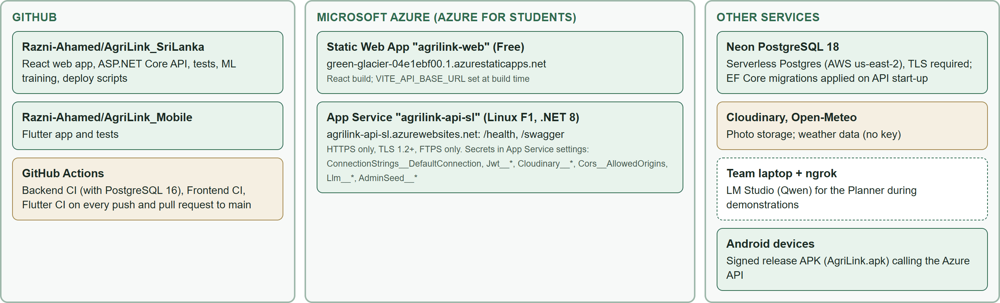
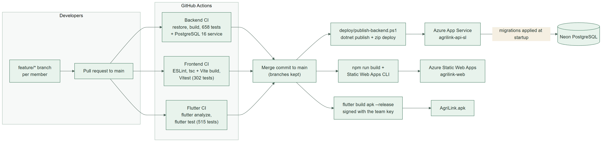
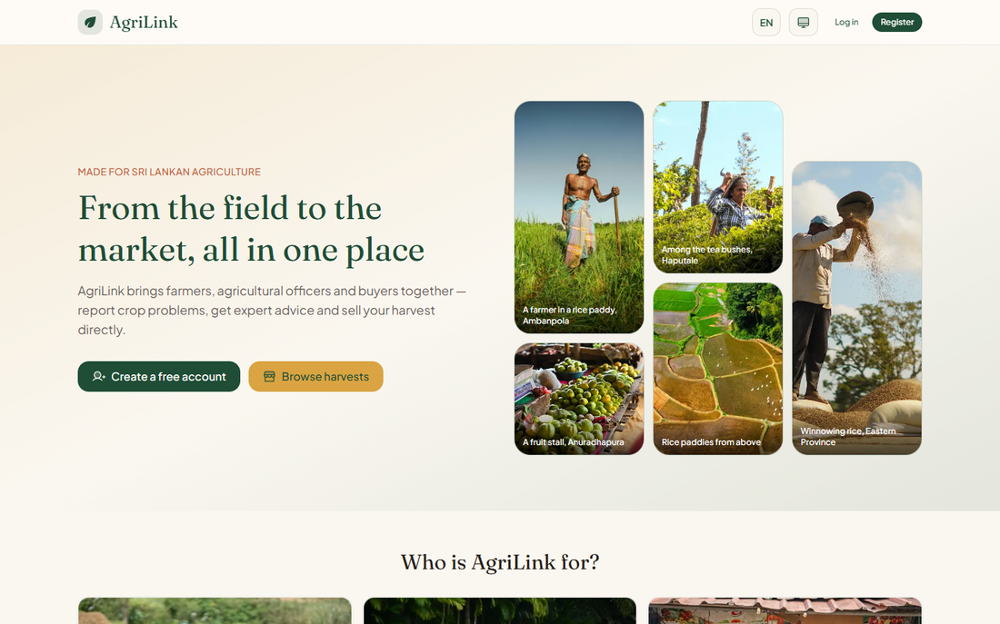

# Deployment report

> Part of the AgriLink Sri Lanka project documentation ([index](../README.md)). Section numbers follow the team's SE3090 Assignment 1 report, so "§" references point to its sections.

Step-by-step commands: [azure.md](azure.md) (API and website) and [llm-planner.md](llm-planner.md) (the Planner's language model).

# 10. Deployment report

## 10.1 Deployment architecture

Everything runs on no-cost services (Azure for Students and free tiers), as the specification requires.

*Deployment: two repositories and their CI workflows, the Azure resources, the Neon database, and the optional language model on the team laptop*

**Deployed resources**

| Component | Service and plan | Details |
|---|---|---|
| ASP.NET Core API | Azure App Service `agrilink-api-sl`, Linux, **F1 (Free)**, .NET 8 | Resource group `agrilink-rg`; HTTPS only; minimum TLS 1.2; FTPS only; state Running (checked with the Azure CLI, 29 Sep 2026) |
| React web app | Azure Static Web Apps `agrilink-web`, **Free** | `green-glacier-04e1ebf00.1.azurestaticapps.net`; `staticwebapp.config.json` sends deep links to `index.html` |
| PostgreSQL | **Neon** serverless PostgreSQL 18.6, AWS us-east-2 | TLS required (`SSL Mode=Require`); the connection string exists only in App Service settings and developers' user-secrets |
| Photo storage | Cloudinary (free) | Authenticated delivery for issue photos |
| Flutter app | Signed release APK | Package `lk.agrilink.mobile`, version 1.0.0 (1), signed with the team's own release key |
| Language model (optional) | LM Studio + ngrok (free dev domain) on the team laptop | Planner only; the API falls back to rules when it is off |

## 10.2 From commit to deployment

*Continuous integration and the deployment steps*

1. Work happens on a feature branch per member or task, and reaches `main` through a pull request merged with a merge commit.
2. GitHub Actions runs Backend CI, Frontend CI and Flutter CI on the pull request and again on `main`.
3. Deployment is a deliberate manual step, run from `main` by the team member who manages the Azure subscription:
   - **API:** `.\deploy\publish-backend.ps1 -ResourceGroup agrilink-rg -AppName agrilink-api-sl`. It runs `dotnet publish` for Linux, includes the ONNX models from `ml/models` (the script stops if they are missing), zips the output and zip-deploys it. Azure reports `RuntimeSuccessful` when the new version starts, and the API applies pending migrations at start-up.
   - **Web:** `npm ci`, then `npm run build` with `VITE_API_BASE_URL=https://agrilink-api-sl.azurewebsites.net`, then `npx @azure/static-web-apps-cli deploy ./dist --env production` with the deployment token read from Azure at deploy time.
   - **Mobile:** `flutter build apk --release`, signed with the release key kept outside the repository.
4. Before a deployment with a migration, the production database is backed up with `pg_dump`. The final deployment's backup is `production-before-final-deploy-2026-09-29.dump`.

## 10.3 Configuration and secrets

- **App Service settings.** They hold exactly the names listed on the evaluator page: `ConnectionStrings__DefaultConnection`, `Jwt__*`, `AdminSeed__*`, `Cloudinary__*`, `Cors__AllowedOrigins`, `Swagger__Enabled`, `Llm__*` and `ASPNETCORE_ENVIRONMENT=Production`.
- **Keys.** Production uses its own JWT key and administrator password, different from development.
- **CORS** in production allows only the Static Web App origin (`Cors__AllowedOrigins`). Mobile apps are not subject to CORS.
- **Repositories.** `appsettings.Development.json` is ignored by Git, and the committed `appsettings.json` contains no secrets. The release signing key, the ONNX models and the language-model key are not in the repositories either.

## 10.4 Database deployment and initialisation

On start-up the API applies every pending EF Core migration (`Database.MigrateAsync`), seeds the four roles, and creates the administrator from `AdminSeed__*` if that account does not exist yet. A new environment needs only an empty PostgreSQL database and the settings above. The demonstration accounts and farm data were created through the API, so they follow every business rule.

## 10.5 Starting the Agentic AI language model

The agents themselves are part of the API. Only the Planner's optional language model needs starting, in this order:

1. On the laptop: `.\deploy\start-llm-planner.ps1 -Domain devotion-drippy-frail.ngrok-free.dev`. It starts LM Studio's server (port 1234), loads `qwen/qwen3.8-27b` onto the GPU (about 17.7 GB of VRAM) unless it is already loaded, writes the tunnel's traffic policy, and opens the ngrok tunnel. Leave the window open.
2. First time only: `.\deploy\connect-llm-planner.ps1 -ResourceGroup agrilink-rg -AppName agrilink-api-sl -Domain <domain>`. This stores `Llm__Enabled`, `Llm__BaseUrl`, `Llm__Model` and `Llm__ApiKey` in the App Service settings.
3. Report an issue. The officer's trace shows **Planned By: LLM (qwen3.8-27b)**.

Requirements: LM Studio 0.4+, the model (about 17 GB), an NVIDIA GPU with at least 18 GB of memory (or a smaller model through `-Model`), and a free ngrok account with a dev domain. Pressing Ctrl+C stops the tunnel, and the API then plans with the rules. The API log confirms the configuration at start-up, for example "Planner: language model qwen3.8-27b at devotion-drippy-frail.ngrok-free.dev, rules as fallback".

## 10.6 Deployment evidence

**Checks made on 29 September 2026**

| Check | Result |
|---|---|
| `GET /health` | 200 `Healthy` (includes the database check) |
| `GET /swagger/v1/swagger.json` | 200, OpenAPI 3.0.1, **80 operations** in 18 controllers |
| HTTP → HTTPS | 301 redirect |
| Website | Serves the current build; the marketplace shows the 12 production listings, and server-side sorting works |
| Applied migrations (`__EFMigrationsHistory`, read-only query) | All 14, from `20260816044650_InitialCreate` to `20260928202105_AddAuditTimestamps` |
| Production schema | 26 tables, 27 primary keys (including the migrations table), 32 foreign keys, 70 indexes; PostgreSQL 18.6 |
| Production data | 29 users (12 farmers, 6 officers, 10 buyers, 1 admin), 12 farms, 24 fields, 24 crops, 12 listings, 1 department |
| Language-model tunnel, from the internet | Wrong path 404; no key or wrong key 401; correct key 200 in 1.4 s; burst 429 |
| Azure CLI | App Service Running (Linux, `DOTNETCORE\|8.0`, HTTPS only, TLS 1.2); plan `agrilink-plan` F1; Static Web App Free |

*The live website's home page, signed out (29 Sep 2026)*

## 10.7 Availability and known constraints

- The team keeps all services running until at least 21 October 2026.
- The F1 plan has no always-on, so expect a cold start of up to about 40 s after idle periods, and it has a daily CPU quota.
- The language-model Planner is available only while the team laptop runs the tunnel, which it will during the demonstration. At other times the rules plan, and every advisory records which planner was used.
- If a free service has an outage near the evaluation, the team will tell the evaluator and provide evidence of the outage, as the specification asks.
