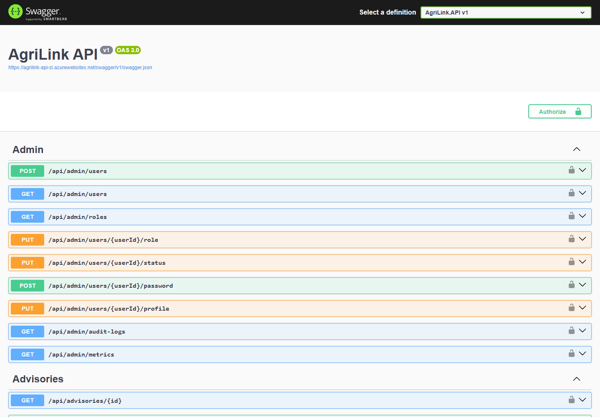

# Software testing report

> Part of the AgriLink Sri Lanka project documentation ([index](README.md)). Section numbers follow the team's SE3090 Assignment 1 report, so "§" references point to its sections.

# 7. Software testing report

## 7.1 Strategy and tools

Every layer has automated tests that run on every pull request. Two kinds of testing were run by hand before release: a scripted API test against a real PostgreSQL database, and end-to-end runs of the cross-platform workflow on both clients. **No test calls the production system.** The automated tests use in-memory or throwaway databases and fake HTTP back ends. The final system test used a separate local PostgreSQL cluster, deleted afterwards.

**Test levels, tools and where they run**

| Level | Tools | Where |
|---|---|---|
| Backend unit, service, validation, auth, controller | xUnit, Moq, EF Core InMemory, Xunit.SkippableFact, coverlet | `backend/AgriLink.API.Tests`; Backend CI |
| Database integration | xUnit against a real PostgreSQL (throwaway database per run) | Backend CI (PostgreSQL 16 service); locally on PostgreSQL 18 |
| Agent evaluation | xUnit golden cases through the real orchestrator; optional live language-model run | Backend CI (golden cases); locally (live model) |
| React | Vitest, React Testing Library, user-event, mocked API modules | `frontend/src/**/*.test.tsx`; Frontend CI |
| Flutter | flutter_test, mocktail, a `FakeApi` HTTP adapter, whole-app `pumpAgriLink` harness | `AgriLink_Mobile/test`; Flutter CI |
| Photo-model pipeline | pytest | `ml/tests`; locally |
| API system test | A Python harness of 292 checks over every endpoint and role | Local API with local PostgreSQL, 29 September 2026 |
| End to end | The Flutter app on an Android emulator, the React app in a browser, the same local API | 29 September 2026 |
| Performance | The same harness's load scenarios; a small read-only sample of the live system | §9 |

## 7.2 Results

**Latest results (all green)**

| Suite | Result | Evidence |
|---|---|---|
| Backend (xUnit) | **656 passed**, 2 skipped, 0 failed (658 total, 17 s) | [Backend CI run on main, 29 Sep 2026](https://github.com/Razni-Ahamed/AgriLink_SriLanka/actions/runs/36539465553). The 2 skipped tests need local resources. The live language-model test was run locally (§8.5). The photo-parity test needs a folder of real photos that is not in the repository |
| React (Vitest) | **302 passed** in 46 files; ESLint 0 errors; `tsc` and Vite build succeed | [Frontend CI run on main](https://github.com/Razni-Ahamed/AgriLink_SriLanka/actions/runs/36522440784) |
| Flutter | **515 passed**; `flutter analyze`: no issues | [Flutter CI run on main](https://github.com/Razni-Ahamed/AgriLink_Mobile/actions/runs/36522252680) |
| Photo pipeline (pytest) | **36 passed** | Local run, 29 Sep 2026 |
| Model parity (.NET ONNX vs Python) | **Tomato 40/40, Potato 40/40**; largest probability difference under 10⁻⁶ | Local run on real photos, 17 Sep 2026 (PR #49) |
| API system test | **291 of 292** checks passed; 0 unhandled server errors | Local run, 29 Sep 2026. The one "failure" is intended behaviour: a phone number with a trailing newline is now trimmed and saved, where the check expected a rejection |

*Swagger UI of the live API, used for manual API checks during development and in the demonstration*

## 7.3 Backend tests

The 57 backend test files (Appendix C) cover every required category:

- **Unit tests** of pure logic: the three agents' rules, photo triage, the Planner's prompt parser and guardrails, paging arithmetic, NIC and phone normalisation, username policy, image preprocessing.
- **Service-layer tests:** the orchestrator (step recording, failures, safe fallback), `NotificationService`, `AuditLogService`, `AccountSessionValidator`, the photo processors and storage, the ONNX classifier, the language-model client (HTTP status codes, timeouts, an empty answer), `AdminSeeder`, `UsernameBackfill`, and automatic `UpdatedAt` stamping.
- **Validation tests:** DTO annotations and business rules. Examples: a field larger than its farm, a harvest date before planting, an unknown sort order, a 151-character notification title, and a page number of `int.MaxValue`.
- **Authentication and authorisation:**
  - `AuthControllerTests` (25 tests): registration, pending and rejected accounts, lockout, admin sign-in, email trimming.
  - `UsersControllerSecurityTests` (20): password change, security stamp, verification.
  - Officer-scope tests: another district's issues are invisible.
  - Ownership tests: another farmer's farm returns 403.
- **Controller tests:** every controller has a test class that calls the actions with a real `ClaimsPrincipal` and an in-memory database, and asserts status codes, response bodies and side effects (notifications, audit rows, stock changes).
- **API integration.** The controller tests run the actions in-process. The HTTP-level integration (routing, model binding, authentication middleware, JSON) was exercised by the 292-check system test (§7.7), which is not part of the repository.

## 7.4 Database tests

`Integration/PostgresIntegrationTests` creates a new database on a real PostgreSQL server for each run, applies the migrations, runs the tests and drops the database. The tests run in CI against a PostgreSQL 16 service container (`AGRILINK_TEST_POSTGRES`).

**PostgreSQL integration tests**

| Test | What it proves |
|---|---|
| `Migrations_AllApply_AndNoneArePending` | All 14 migrations apply to an empty database in order |
| `Model_HasNoChangesMissingFromTheMigrations` | The EF model and the migrations agree; a forgotten migration fails CI |
| `UniqueEmailIndex_RefusesASecondAccountWithTheSameEmail` | The unique index holds even when application checks are bypassed |
| `Departments_ParallelCreatesWithOneName_OneSucceedsTheRestAre` (409) | A race on a unique name gives one 201 and 409s, never a 500 |
| `RolledBackTransaction_LeavesNothingBehind` | A failed multi-step write leaves no partial rows |
| `RestrictForeignKey_ABuyerWithPurchaseRequestsCannotBeDeleted` | `ON DELETE RESTRICT` protects trade history (SQLSTATE 23503 or 23001) |
| `RowVersion_TwoEditsFromTheSameStartingPoint_TheSecondIsRefused` | The `xmin` concurrency token rejects a stale update |
| `Paging_TheLargestPageNumber_IsAnEmptyPageNotAnError` | Large page numbers cannot overflow the SQL `OFFSET` |

## 7.5 React tests

- **Component tests:** tables, badges, the pagination and search-and-sort controls, the avatar, the advisory panel, the photo-diagnosis review panel, the photo picker, the home page.
- **Form validation:** registration (`RegisterPage`, 18 tests), password rules (`passwordSchema`, `PasswordChecklist`), field, crop and profile forms, the change-password and edit-user forms. Each test checks that invalid input shows the right message and blocks submission.
- **Protected routes:** `RouteGuards.test.tsx` checks that signed-out users are redirected to login, that a wrong role gets the Unauthorised page, and that the right role gets through. `HomeRoute` and `roleHome` check the landing page for each role.
- **API integration:** the API modules (`issuesApi`, `advisoriesApi`, `registrationsApi`) are tested against a mocked HTTP client, checking the URLs, parameters and parsing. Pages are tested with mocked query hooks.
- **Error states:** `apiErrors` (15 tests) maps server responses to messages. Pages are tested for their loading, empty and error states, including the approve/reject controls when the server refuses.

## 7.6 Flutter tests

- **Unit:** models and JSON parsing for every feature, validators, the API error parser, formatters, session restoration and expiry, and the translation importer.
- **Widget:** shared widgets (loading, error, empty, badges, the password checklist) and each feature's screens.
- **Form validation:** registration, login, farm, field and crop forms, issue reporting, listings, officer review controls, and admin user creation.
- **Navigation:** `shell_test.dart` checks the role shell and route guards. Tests start the whole app signed in as each role (`pumpAgriLink`) and check which tabs and pages are reachable.
- **API integration:** `FakeApi` records every request, so tests assert the exact method, path and JSON body the app sends, and simulate 4xx and 5xx errors and a missing connection.

## 7.7 End-to-end and system testing

The complete cross-platform workflow was run on 29 September 2026 against a local API and database:

1. **Flutter, farmer:** reported "Dark spots with rings on tomato leaves" with a gallery photo.
2. **API and PostgreSQL:** the trace recorded ImageClassificationAgent → PlannerAgent → PhotoTriageAgent → WeatherAgent (Open-Meteo) → ValidationAgent. The advisory was saved as **Draft**, with escalation reasons.
3. **React, officer:** reviewed the photo, trace and reasons, confirmed the diagnosis, added a treatment and approved.
4. **Flutter, farmer:** the issue showed **Resolved** with the officer's diagnosis, advice and note, and an Android notification arrived.

The officer then rejected another issue from the mobile app. The web and mobile apps showed the same farms, orders and reviews throughout. The 292-check API system test covered every endpoint and role in 12 sections.

**API system test sections (29 September 2026)**

| Section | Checks | Passed |
|---|---|---|
| A. Public endpoints and authentication basics | 19 | 19 |
| B. Admin setup: departments and staff accounts | 22 | 22 |
| C. Registration and approvals | 34 | 33 (intended change, see §7.2) |
| D. Farms, fields, crops (Component A) | 33 | 33 |
| E. Crop issues, Agentic AI workflow and human approval (Component B) | 66 | 66 |
| F. Marketplace: harvest listings (Component C) | 21 | 21 |
| G. Purchase requests and orders (Component D) | 33 | 33 |
| H. Notifications | 11 | 11 |
| I. Profile and security | 20 | 20 |
| J. Admin: users, roles, status, audit, metrics | 19 | 19 |
| K. Input robustness (oversized, malformed, wrong types, huge numbers) | 8 | 8 |
| L. Load and performance | 6 | 6 |

## 7.8 Manual test cases

Besides the automated suites, the team ran scripted manual test cases through the user interface. Each member also recorded ten test cases for their own component, in their Individual Report in Part B.

**Group manual test cases (web and mobile, against the running system)**

| ID | Test | Preconditions and steps | Expected result | Result |
|---|---|---|---|---|
| TC_1 | Valid registration | Not registered: open registration, enter valid details, submit | Account created and waiting for approval | Pass |
| TC_2 | Invalid registration | Registration page: enter an invalid NIC, phone or password, submit | Validation errors shown; nothing is saved | Pass |
| TC_3 | Farmer creates a crop | Farmer signed in, farm exists: open farm, field, add crop | Crop created | Pass |
| TC_4 | Crop issue reporting | Farmer owns the crop: create an issue, submit | Issue created and the agent workflow runs | Pass |
| TC_5 | AI photo diagnosis | Issue with a photo of a supported crop: upload, submit | Classification and advisory workflow run; trace recorded | Pass |
| TC_6 | Officer review | Pending advisory exists: sign in as the district's officer, open the issue | Review controls (approve, reject, revise) available | Pass |
| TC_7 | Marketplace listing | Farmer owns the crop: create a listing, submit | Listing created and visible in the marketplace | Pass |
| TC_8 | Purchase request | Buyer signed in, listing exists: open the listing, request a quantity | Request created and the farmer notified | Pass |
| TC_9 | Unauthorised action | Wrong role signed in: attempt a protected action | Access denied (403, or the Unauthorised page) | Pass |
| TC_10 | Notification | Trigger an event, open notifications | Notification displayed and the unread count updated | Pass |

## 7.9 Defects found by the final testing

The first system-test run found 19 unhandled 500 errors and several logic defects. All were fixed in pull request #69, each with a regression test:

- Huge page numbers overflowed into a negative SQL `OFFSET` (500); page numbers are now capped.
- Parallel department creation with one name returned 500; it now returns 409.
- Notification titles over 150 characters returned 500; empty titles were accepted. Both are now validation errors.
- Login did not trim the email; admin-created accounts could be saved with spaces.
- NIC and phone rules accepted Sinhala and Tamil digits and a trailing newline.
- A field could be larger than its farm, and a harvest could be dated before planting.
- Cancelling an order reopened a listing the farmer had marked Sold by hand.
- The advice text had doubled full stops. Approved advice still said "pending review".
- The trace showed "Risk Level 1" instead of "Medium" (enums are now stored by name).
- There was no health URL and no global error handler (both added).
- The web farm, field and crop forms swallowed server errors.

## 7.10 Regression testing and defect handling

The system was built by four people on separate branches, so a change in a shared area could break features built earlier. Examples of shared areas are authentication, API contracts, database entities, notifications, paging and profile security. The existing automated tests ran as regression checks on every pull request, and a feature that added a business rule or changed a response shape added its own tests. Defects were handled by reproducing the failure, finding the responsible layer, fixing it, and re-running the relevant tests with a new regression test.

**Defect categories and how they were handled**

| Category | Example | Handling |
|---|---|---|
| Functional | Incorrect status transition | Fix the business logic and add a regression test |
| Validation | Invalid data accepted | Add the validation rule and a negative test |
| Authorisation | Wrong role allowed | Correct the server-side role or ownership check |
| Integration | Frontend and API contract mismatch | Update the API, the query hook and the component together |
| Data | Incorrect relationship or query | Correct the EF Core model or query, with a migration if needed |
| AI | Low-confidence result | Triage and escalation to an officer, never automatic release |
| External service | Weather service failure | Recorded fallback; the workflow continues |
| UI | Stale state after a change | Correct the query invalidation or provider refresh |

## 7.11 Continuous integration

Three GitHub Actions workflows run on every push and pull request to `main`:

- **Backend CI:** restore, build in Release, run all backend tests with a PostgreSQL 16 service, and upload the TRX results.
- **Frontend CI:** `npm ci`, `npm run lint` (ESLint), `npm run build` (TypeScript check and Vite build), then Vitest.
- **Flutter CI:** `flutter pub get`, `flutter analyze`, `flutter test`.

The final pull requests (web #69 to #72, mobile #13) were merged only after every check passed. One of them, #71, first failed a timing assertion on the slower CI runner, which was fixed before merging.

## 7.12 Gaps

- The HTTP-level API test harness and the end-to-end run are not automated in the repository. A `WebApplicationFactory` test project and a Playwright or `integration_test` flow would make them repeatable in CI.
- Code coverage is not measured in CI.
- The live language-model evaluation needs the team laptop, so CI skips it.

# Test inventory

Every automated test file in both repositories, with the number of test methods declared in it and the team member who created the file (from `git log --follow`). A parameterised test counts once here; the runners count each case, which is why the CI totals are higher.

## Backend (xUnit), `backend/AgriLink.API.Tests`

| Test file | Tests | Created by |
|---|---|---|
| `Agents/AgentGoldenCaseEvaluationTests.cs` | 6 | Razni Ahamed M. R. |
| `Agents/AgentOrchestratorTests.cs` | 14 | Razni Ahamed M. R. |
| `Agents/CropAnalysisAgentTests.cs` | 12 | Gayathri M. G. K. |
| `Agents/DiseaseKnowledgeBaseTests.cs` | 4 | Razni Ahamed M. R. |
| `Agents/LlmPlannerAgentTests.cs` | 13 | Razni Ahamed M. R. |
| `Agents/LlmPlannerLiveEvaluationTests.cs` | 1 | Razni Ahamed M. R. |
| `Agents/PhotoTriageTests.cs` | 8 | Razni Ahamed M. R. |
| `Agents/PlannerAgentTests.cs` | 6 | Razni Ahamed M. R. |
| `Agents/PlannerPromptTests.cs` | 6 | Razni Ahamed M. R. |
| `Agents/ValidationAgentTests.cs` | 16 | Jayaweera A.J.D. |
| `Agents/WeatherAgentTests.cs` | 9 | Fernando C. P. H. A. C. |
| `Controllers/AdminControllerProfileTests.cs` | 10 | Gayathri M. G. K. |
| `Controllers/AdminControllerTests.cs` | 35 | Razni Ahamed M. R. |
| `Controllers/AdvisoriesControllerPhotoReviewTests.cs` | 14 | Razni Ahamed M. R. |
| `Controllers/AdvisoriesControllerReviewContextTests.cs` | 6 | Razni Ahamed M. R. |
| `Controllers/AdvisoriesControllerTests.cs` | 7 | Razni Ahamed M. R. |
| `Controllers/AuthControllerTests.cs` | 25 | Razni Ahamed M. R. |
| `Controllers/CropsControllerTests.cs` | 9 | Razni Ahamed M. R. |
| `Controllers/DepartmentsControllerTests.cs` | 6 | Razni Ahamed M. R. |
| `Controllers/FarmsControllerDistrictTests.cs` | 3 | Razni Ahamed M. R. |
| `Controllers/FarmsControllerFieldTests.cs` | 8 | Razni Ahamed M. R. |
| `Controllers/HarvestsControllerSearchSortTests.cs` | 4 | Razni Ahamed M. R. |
| `Controllers/HarvestsControllerTests.cs` | 14 | Razni Ahamed M. R. |
| `Controllers/IssuesControllerCreatePhotoTests.cs` | 8 | Razni Ahamed M. R. |
| `Controllers/IssuesControllerCropDetailsTests.cs` | 2 | Razni Ahamed M. R. |
| `Controllers/IssuesControllerGetAllTests.cs` | 1 | Razni Ahamed M. R. |
| `Controllers/IssuesControllerOfficerScopeTests.cs` | 5 | Razni Ahamed M. R. |
| `Controllers/IssuesControllerPagingTests.cs` | 5 | Gayathri M. G. K. |
| `Controllers/IssuesControllerReviewQueueAndPhotoTests.cs` | 6 | Razni Ahamed M. R. |
| `Controllers/IssuesControllerSearchSortTests.cs` | 6 | Razni Ahamed M. R. |
| `Controllers/NotificationsControllerTests.cs` | 5 | Gayathri M. G. K. |
| `Controllers/OfficerControllerTests.cs` | 3 | Razni Ahamed M. R. |
| `Controllers/OrdersControllerTests.cs` | 12 | Razni Ahamed M. R. |
| `Controllers/ProfileChangeRequestsControllerTests.cs` | 13 | Gayathri M. G. K. |
| `Controllers/PurchaseRequestsControllerTests.cs` | 11 | Razni Ahamed M. R. |
| `Controllers/RegistrationsControllerTests.cs` | 16 | Jayaweera A.J.D. |
| `Controllers/UsersControllerPhotoTests.cs` | 11 | Jayaweera A.J.D. |
| `Controllers/UsersControllerProfileTests.cs` | 24 | Jayaweera A.J.D. |
| `Controllers/UsersControllerSecurityTests.cs` | 20 | Gayathri M. G. K. |
| `Controllers/UsersControllerTests.cs` | 8 | Razni Ahamed M. R. |
| `Integration/PostgresIntegrationTests.cs` | 8 | Razni Ahamed M. R. |
| `Services/AccountSessionValidatorTests.cs` | 6 | Gayathri M. G. K. |
| `Services/AdminSeederTests.cs` | 3 | Razni Ahamed M. R. |
| `Services/AgriLinkDbContextModelTests.cs` | 2 | Razni Ahamed M. R. |
| `Services/AuditLogServiceTests.cs` | 2 | Razni Ahamed M. R. |
| `Services/AuditTimestampTests.cs` | 3 | Razni Ahamed M. R. |
| `Services/ImagePreprocessorParityTests.cs` | 1 | Razni Ahamed M. R. |
| `Services/IssuePhotoProcessorTests.cs` | 13 | Razni Ahamed M. R. |
| `Services/LocalImageStorageServiceTests.cs` | 5 | Razni Ahamed M. R. |
| `Services/LocalProfilePhotoStorageTests.cs` | 7 | Jayaweera A.J.D. |
| `Services/OnnxImageClassifierTests.cs` | 7 | Razni Ahamed M. R. |
| `Services/OpenAiCompatibleLlmClientTests.cs` | 6 | Razni Ahamed M. R. |
| `Services/PagingAndHealthTests.cs` | 5 | Razni Ahamed M. R. |
| `Services/ProfilePhotoProcessorTests.cs` | 11 | Jayaweera A.J.D. |
| `Services/RealModelParityTests.cs` | 1 | Razni Ahamed M. R. |
| `Services/UsernameBackfillTests.cs` | 7 | Jayaweera A.J.D. |
| `Services/UsernamePolicyTests.cs` | 11 | Jayaweera A.J.D. |

## Web (Vitest + Testing Library), `frontend/src`

| Test file | Tests | Created by |
|---|---|---|
| `app/AccountButtons.test.tsx` | 3 | Razni Ahamed M. R. |
| `app/AppLayout.test.tsx` | 8 | Jayaweera A.J.D. |
| `app/HomeRoute.test.tsx` | 7 | Razni Ahamed M. R. |
| `app/RouteGuards.test.tsx` | 4 | Razni Ahamed M. R. |
| `app/roleHome.test.ts` | 1 | Razni Ahamed M. R. |
| `auth/AdminLoginPage.test.tsx` | 5 | Razni Ahamed M. R. |
| `auth/LoginPage.test.tsx` | 5 | Razni Ahamed M. R. |
| `auth/RegisterPage.test.tsx` | 18 | Jayaweera A.J.D. |
| `components/ui/Pagination.test.tsx` | 5 | Gayathri M. G. K. |
| `components/ui/PasswordChecklist.test.tsx` | 5 | Fernando C. P. H. A. C. |
| `components/ui/SearchSortBar.test.tsx` | 1 | Razni Ahamed M. R. |
| `components/ui/UserAvatar.test.tsx` | 5 | Jayaweera A.J.D. |
| `features/account/components/ChangePasswordForm.test.tsx` | 4 | Gayathri M. G. K. |
| `features/account/components/GeneralSettingsTab.test.tsx` | 15 | Jayaweera A.J.D. |
| `features/account/components/ProfileDialog.test.tsx` | 7 | Jayaweera A.J.D. |
| `features/account/components/SecuritySettingsTab.test.tsx` | 13 | Gayathri M. G. K. |
| `features/farms/components/FieldForm.test.tsx` | 3 | Razni Ahamed M. R. |
| `features/home/HomePage.test.tsx` | 3 | Razni Ahamed M. R. |
| `features/issues/api/advisoriesApi.test.ts` | 3 | Razni Ahamed M. R. |
| `features/issues/api/issuesApi.test.ts` | 2 | Razni Ahamed M. R. |
| `features/issues/components/AdvisoryPanel.test.tsx` | 4 | Razni Ahamed M. R. |
| `features/issues/components/ApproveRejectControls.test.tsx` | 9 | Razni Ahamed M. R. |
| `features/issues/components/PhotoDiagnosisReviewPanel.test.tsx` | 3 | Razni Ahamed M. R. |
| `features/issues/components/PhotoPicker.test.tsx` | 3 | Razni Ahamed M. R. |
| `features/issues/lib/preparePhoto.test.ts` | 6 | Razni Ahamed M. R. |
| `features/issues/lib/reportErrorKey.test.ts` | 3 | Razni Ahamed M. R. |
| `features/issues/pages/AllIssuesPage.test.tsx` | 3 | Razni Ahamed M. R. |
| `features/issues/pages/MyIssuesPage.test.tsx` | 2 | Razni Ahamed M. R. |
| `features/issues/pages/PendingIssuesPage.test.tsx` | 1 | Razni Ahamed M. R. |
| `features/marketplace/components/HarvestFilterBar.test.tsx` | 2 | Razni Ahamed M. R. |
| `features/orders/components/EditUserForm.test.tsx` | 9 | Gayathri M. G. K. |
| `features/orders/components/UserManagementTable.test.tsx` | 6 | Razni Ahamed M. R. |
| `features/orders/lib/chartColors.test.ts` | 3 | Razni Ahamed M. R. |
| `features/orders/lib/userListFilters.test.ts` | 6 | Razni Ahamed M. R. |
| `features/registrations/api/registrationsApi.test.ts` | 3 | Jayaweera A.J.D. |
| `features/registrations/components/ProfileChangesTab.test.tsx` | 5 | Gayathri M. G. K. |
| `features/registrations/components/RegistrationsTab.test.tsx` | 9 | Jayaweera A.J.D. |
| `features/registrations/pages/PendingRegistrationsPage.test.tsx` | 3 | Jayaweera A.J.D. |
| `i18n/languageSwitching.test.tsx` | 6 | Razni Ahamed M. R. |
| `lib/apiErrors.test.ts` | 15 | Fernando C. P. H. A. C. |
| `lib/passwordSchema.test.ts` | 8 | Fernando C. P. H. A. C. |
| `lib/photoUrl.test.ts` | 4 | Razni Ahamed M. R. |
| `lib/themeStorage.test.ts` | 14 | Razni Ahamed M. R. |
| `lib/useUiStore.test.ts` | 8 | Razni Ahamed M. R. |
| `lib/validation.test.ts` | 7 | Fernando C. P. H. A. C. |
| `themeTokens.test.ts` | 3 | Razni Ahamed M. R. |

## Mobile (flutter_test), `AgriLink_Mobile/test`

| Test file | Tests | Created by |
|---|---|---|
| `app/shell_test.dart` | 12 | Razni Ahamed M. R. |
| `app/theme_test.dart` | 5 | Razni Ahamed M. R. |
| `core/api_client_test.dart` | 9 | Razni Ahamed M. R. |
| `core/api_error_parser_test.dart` | 7 | Razni Ahamed M. R. |
| `core/session_and_format_test.dart` | 9 | Razni Ahamed M. R. |
| `core/validators_test.dart` | 12 | Razni Ahamed M. R. |
| `features/account/account_test.dart` | 14 | Razni Ahamed M. R. |
| `features/admin/admin_dashboard_test.dart` | 5 | Fernando C. P. H. A. C. |
| `features/admin/admin_models_test.dart` | 13 | Fernando C. P. H. A. C. |
| `features/admin/audit_log_test.dart` | 12 | Fernando C. P. H. A. C. |
| `features/admin/create_user_test.dart` | 16 | Fernando C. P. H. A. C. |
| `features/admin/departments_test.dart` | 13 | Fernando C. P. H. A. C. |
| `features/admin/user_detail_test.dart` | 26 | Fernando C. P. H. A. C. |
| `features/admin/users_test.dart` | 15 | Fernando C. P. H. A. C. |
| `features/auth/login_test.dart` | 10 | Razni Ahamed M. R. |
| `features/auth/register_test.dart` | 9 | Razni Ahamed M. R. |
| `features/auth/splash_test.dart` | 6 | Razni Ahamed M. R. |
| `features/farmer/farmer_data_test.dart` | 17 | Gayathri M. G. K. |
| `features/farmer/farmer_issues_test.dart` | 31 | Gayathri M. G. K. |
| `features/farmer/farmer_screens_test.dart` | 36 | Gayathri M. G. K. |
| `features/issues/advisory_widgets_test.dart` | 15 | Gayathri M. G. K. |
| `features/issues/issue_models_test.dart` | 13 | Gayathri M. G. K. |
| `features/issues/issues_api_test.dart` | 9 | Gayathri M. G. K. |
| `features/marketplace/browse_harvests_test.dart` | 4 | Jayaweera A.J.D. |
| `features/marketplace/harvest_detail_test.dart` | 9 | Jayaweera A.J.D. |
| `features/marketplace/marketplace_api_test.dart` | 6 | Jayaweera A.J.D. |
| `features/marketplace/marketplace_languages_test.dart` | 2 | Jayaweera A.J.D. |
| `features/marketplace/marketplace_models_test.dart` | 16 | Jayaweera A.J.D. |
| `features/marketplace/my_listings_test.dart` | 6 | Jayaweera A.J.D. |
| `features/marketplace/orders_test.dart` | 7 | Jayaweera A.J.D. |
| `features/marketplace/requests_test.dart` | 7 | Jayaweera A.J.D. |
| `features/notifications/notifications_test.dart` | 10 | Razni Ahamed M. R. |
| `features/officer/approvals_test.dart` | 16 | Fernando C. P. H. A. C. |
| `features/officer/officer_dashboard_test.dart` | 6 | Fernando C. P. H. A. C. |
| `features/officer/review_api_test.dart` | 6 | Fernando C. P. H. A. C. |
| `features/officer/review_controls_test.dart` | 17 | Fernando C. P. H. A. C. |
| `features/officer/review_flow_test.dart` | 19 | Fernando C. P. H. A. C. |
| `features/officer/review_panels_test.dart` | 13 | Fernando C. P. H. A. C. |
| `features/officer/review_rules_test.dart` | 16 | Fernando C. P. H. A. C. |
| `l10n/l10n_test.dart` | 3 | Razni Ahamed M. R. |
| `shared/paged_list_test.dart` | 7 | Razni Ahamed M. R. |
| `shared/shared_widgets_test.dart` | 10 | Razni Ahamed M. R. |
| `tool/import_web_translations_test.dart` | 12 | Razni Ahamed M. R. |

## Photo-model pipeline (pytest), `ml/tests`

| Test file | Tests | Created by |
|---|---|---|
| `test_dedupe_and_split.py` | 5 | Razni Ahamed M. R. |
| `test_evaluation.py` | 11 | Razni Ahamed M. R. |
| `test_folder_sources.py` | 7 | Razni Ahamed M. R. |
| `test_labels.py` | 5 | Razni Ahamed M. R. |
| `test_prepare.py` | 4 | Razni Ahamed M. R. |
| `test_train_smoke.py` | 1 | Razni Ahamed M. R. |
